### 
I'm Pradeeka R, Passionate Data Analytics 👨‍💻 🚀
  
  
🎓 B.E. Electrical and Electronics Engineering (EEE) Graduate  
📊 Aspiring Data Analyst  
💻 Skills: SQL | Python | Microsoft Excel | Power BI  
📈 Interested in Data Analytics, Data Visualization & Business Intelligence

   

## 💻 My Skill Set

### 📊 Data Analysis

</td></tr></table>  

   

## Connect with me  

  <!-- Gmail -->
  

  <!-- LinkedIn -->
  

  

  

   

### 📊 GitHub Stats

  <table>
    <tr>
      <td>
        
      </td>
      <td>
        
      </td>
    </tr>
  </table>

---

### 🔥 Contribution Streak

---

<!--Dynamic Quote card updates everyday at 12 PM--> 

  

   

  
  

   

 
